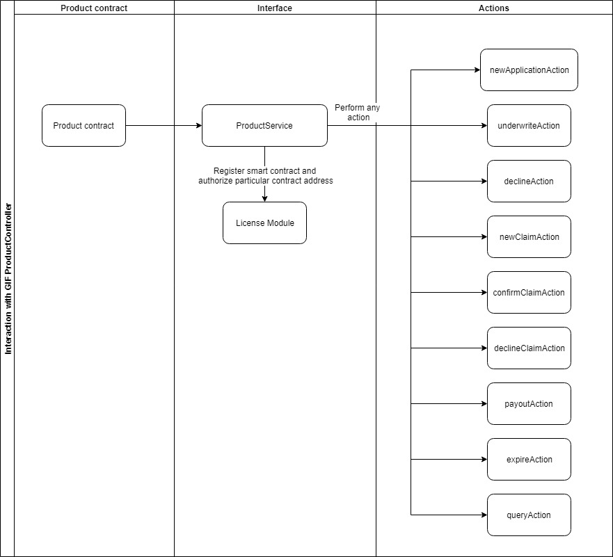

.. _rst_table_of_contents:

Core Smart Contracts
####################

Core smart contracts represent a number of key contracts and modules. The product service, policy flow, and modules are described below.
Core smart contracts are deployed and operated by an instance operator - a DAO or some other (legal) entity.
The instance operator publishes the entry points to its instance of the GIF (e.g. the address of the Product Service) and registers actors in the instance.

Product Service
===============

The **product service** is an entry point for a product contract. During smart contract deployment, the address of the product service should be passed as one of the constructor arguments.

All product service methods are used by a product contract.

Below, you will find a list of the methods invoked by the product service:

- **register** is used to register new product contracts by providing a product name and specifying a policy flow. On approval, a product contract obtains access to call entry methods.

- **newApplication** is employed to store new application data, which contains such fields as premium amount, currency, payout options, risk definition, etc. A policy buyer signs a policy agreement using this method.

- **underwrite** is used to sign a policy agreement by an insurance company. 

- **decline** declines an application. 

- **newClaim** declares a new claim.

- **confirmClaim** confirms a claim. A new payout object is created after this.

- **declineClaim** declines a claim.

- **payout** declares payout that was handled off-chain or on-chain based on the policy currency.

- **expire** sets a policy expiration.

- **request** is used to communicate with oracles when a smart contract requires data or a decision by a particular actor. 

- **getPayoutOptions** checks payout options data.

- **getPremium** checks a premium per application. 

On the diagram below, you can see the actions a product service performs.

The code below illustrates how the above-mentioned methods can be invoked.

.. code-block:: solidity
   :linenos:

    interface IProductService {
            function register(bytes32 _productName, bytes32 _policyFlow)
                external
                returns (uint256 _registrationId);
 
            function newApplication(
                bytes32 _bpExternalKey,
                uint256 _premium,
                bytes32 _currency,
                uint256[] calldata _payoutOptions
            ) external returns (uint256 _applicationId);
         
            function underwrite(uint256 applicationId)
                external
                returns (uint256 _policyId);
 
            function decline(uint256 _applicationId) external;
         
            function newClaim(uint256 _policyId) external returns (uint256 _claimId);
         
            function confirmClaim(uint256 _claimId, uint256 _sum)
                external
                returns (uint256 _payoutId);
         
            function declineClaim(uint256 _claimId) external;
         
            function expire(uint256 _policyId) external;
         
            function payout(uint256 _payoutId, uint256 _sum)
                external
                returns (uint256 _remainder);
         
            function getPayoutOptions(uint256 _applicationId)
                external
                returns (uint256[] memory _payoutOptions);
         
            function getPremium(uint256 _applicationId)
                external
                returns (uint256 _premium);
         
            function request(
                bytes calldata _input,
                string calldata _callbackMethodName,
                address _callabackContractAddress,
                bytes32 _oracleTypeName,
                uint256 _responsibleOracleId
                ) external returns (uint256 _requestId);
        }

Policy Flow
===========
The **policy flow contract** implements business logic for a policy life cycle. A product contract should specify a desired policy flow contract during registration. The policy flow contract has permissions to manage modules.

A policy life cycle could be defined as a "state machine." By this definition, a policy flow contract specifies transition rules between states of core objects (applications, policies, claims, and payouts) and a sequence of actions that manage the "state machine."

A policy flow contract contains the logic of how to handle the GIF contract modules and operate application, policy, claim and payout entities.
