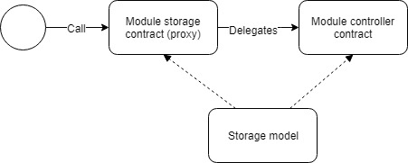

.. _rst_table_of_contents:

Generic Insurance Framework
############################
The Generic Insurance Framework represents a combined codebase for the Decentralized Insurance Platform, a basic implementation that enables users to develop blockchain-based applications.

The basic idea behind the GIF is to abstract the generic parts shared across multiple different products and leave only product-specific parts, such as risk model, pricing, and payout configurations, to be adjusted. The goal is to enable quick and easy deployment of working products.

In its core, the GIF accumulates a number of componets:

- core smart contracts

- core microservices

- product-specific smart contracts

- product-specific microservices

Essentially, the GIF has two major layers — a smart contracts one and a utility one — with DIP Foundation and partners being able to contribute to both.

The **smart contracts layer** is designed in the way that any blockchain product built on top of the GIF can be easily implemented into any network supporting the Ethereum Virtual Machine. Any product owner is able to create a full-featured decentralized app by adding a couple of simple domain-specific contracts to a number of generic ones that the framework provides.

The core contracts are deployed on-chain and operate by an instance operator as a shared service for many different products. The instance operator can be a decentralized organization (DAO) or a more traditional legal entity. A product, working on top of the GIF, is a smart contract (or set of smart contracts) connected to the framework's core contracts through a unique entry point.

The DIP declares the underlying principles and requirements based on which the architecture of smart contracts is developed:

- Generic Insurance Framework provides a unified interface, which connects a product to data and decision providers (oracles).

- A product contract utilizes a simple and clear interface for integration with the GIF.

- Once the agreement is signed and a policy token is issued, parties cannot change the expected policy flow behavior. A policy life cycle should operate on the contracts, which this policy was issued by.

- Core contracts can be upgraded. This is needed to make bug fixes and add new features. 

The smallest building blocks are called "modules." A "module" is a pair of a "storage" contract and a "controller." They share the same storage model and interface objects. The "storage" contract is a proxy, which delegates calls from a "storage" to a "controller," which implements basic logic (i.e., a method to change a state). This mechanism ensures that the module can be upgraded.

A "service" contract contains business logic details and defines rules (i.e., "Underwritten" is the next state after "Applied"). The "service" contract manages modules by calling controllers from storages. It is also an entry point for actors (products, oracles, product owners, etc.).

"Controllers" serve as entry points for "services." It is important to differentiate "services" behavior from that of "controllers."

 

The **utility layer** can contain any number of off-chain utility services supplementing the on-chain functionality. For example, statistical monitoring of events triggered by contracts, making e-mail or instant messenger notifications, accepting fiat payments for policies, as well as making fiat payouts. As a result, any product app can be fully functional on chain even without any support from the utility layer, as well as can provide a full spectrum of the required features.

The key feature to have in a framework is the ability to upgrade and replace individual elements of the system. For this purpose, the Generic Insurance Framework employs a microservices-based architecture approach for its utility layer. The GIF organizes off-chain operations as a collection of loosely coupled services, each implementing a single independent function — a state known as "decomposition by business capabilities."
