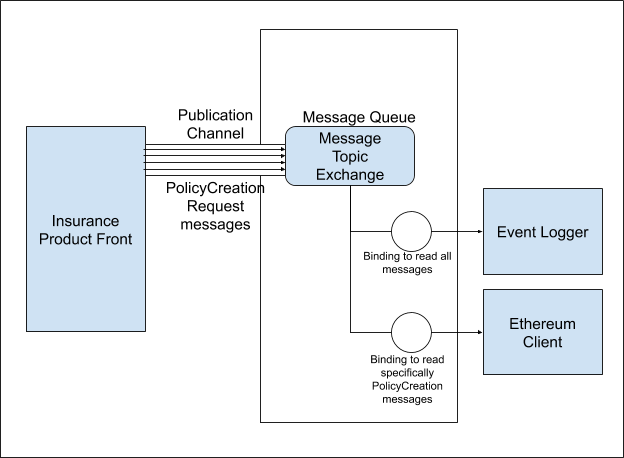


Message Queue
*************

The concept used for connecting numerous platform microservices is the following: to use a central message queue supporting the AMQP protocol, currently implemented in RabbitMQ, to deliver signals between different actors. As one of the possible patterns for organization of microservices, the message queue helps to solve some inherent microservices issues, such as: 

Discoverability. Each microservice does not need to find all other microservices it interacts with. The only thing it should know is where the queue is.

Extensibility. New types of microservices can be introduced to process the old types of messages without any changes to existing ones.

Resiliency. The message queue serves as a storage for undelivered messages until it needs to deliver them to get the microservice back to the operational state.

The @etherisc/microservice npm package
**************************************

For convenience, the logic of the message queue interaction for all the node-based microservices (along with some other potentially common adapters, like a relational database or a file storage) was packaged into a npm package called @etherisc/microservice. 

Product's contract developers should include @etherisc/microservice as an ‘npm’ dependency for any of its Product specific microservices.

To get it working properly, you'd need to provide a list of environmental variables:

AMQP_MODE, AMQP_HOST, AMQP_PORT, AMQP_USERNAME, AMQP_PASSWORD - your product credentials for message queue access, which should be provided to you when you register your product to operate on the DIP platform.

The main thing you get for including this npm package is the ability to start your node.js microservice by simply invoking the ‘bootstrap’ method in your main ‘node’ executable. That will allow you to pick which general areas you’d like your microservice to work with (amqp, database, storage) or, for the product microservices, which insurance process template you’d like your product to follow.

Let’s assume that you want to create a message logging microservice for your product.

When using the CLI for the first time, you need to register a user. Then, you can create your product, add customers, etc.

There are three modes of working with the CLI: a basic **CLI mode** (you can use it by inputing ``gifcli [COMMAND]`` in your system's command line), a **console mode** (using the ``gifcli console command``) and an **execute mode** (by the ``gifcli exec`` command). As we've mentioned, the first one becomes available right after the installation of the GIF CLI. The other commands would be ready for use just after you have created a user and a product. The **console mode** enables you to input methods one by one directly into the command line, and the **execute mode** allows to write sequence of commands in a particular file and then execute this file in the CLI.

In the console mode, as well as in the execute mode, you interact with your product directly — the CLI executes commands on behalf of the current product (you can see the name of your current product in such a line: ``GIF :: ` **your product name** ` $ [COMMAND]``). As soon as you have several products, you can switch between them getting to the necessary product by the **gifcli product:select** command. To execute the gifcli commands, you should first exit from the console (or execute) mode by running ``Ctrl+C twice``.

In case of doubt, you can always refer to the ``gifcli help [COMMAND]`` command in the **CLI mode**. There, you can find a list of currently available commands. The execution of this command looks like that.

::

    'bash >
        npm install --save @etherisc/microservice

::

    const { bootstrap } = require('@etherisc/microservice');
 
    class MessageLogger {
        constructor({ amqp }) {
            this.amqp = amqp;
        }
        async bootstrap() {
            // The code for your particular amqp subscriptions and
            // other asynchronous behaviours to be initialized
        }
    }
    bootstrap(MessageLogger, {
        amqp: true,  
    });

Message versioning. Publish and Subscribe functions
***************************************************

We’d like to point out that for a microservice architecture controlled via a message queue, two types of objects need to be strictly versioned (following the Semantic Versioning 2.0 specification when possible):

Message types. For all message types on the platform, we’re planning to have an up-to-date entry in the ‘@etherisc/microservice/io/amqp/messages/types’ folder that will keep the information on what data is expected to be included in that message, as well as if attributes are required or optional. It was decided to tag each message type with a pair of numbers ‘X.Y’ in a way that X is the MAJOR version and Y is MINOR version. Any change to the schema of a message should result in aversion change. If the changes are ‘breaking’ (such as the removal of required attributes), the MAJOR version needs to be incremented, otherwise - the MINOR one.

Microservice repositories. Each individual core microservice application will have a version label consisting of three integers ‘X.Y.Z’, as well as a reference list of message types it creates and consumes (with their appropriate version tags). The subscription logic inside the service needs to be aware of the version it accepts, while the publishing logic needs to clearly indicate what version of a particular message is produced.

So for the example implementation of MessageLogger, the subscription command would look like this:

::

    const { bootstrap } = require('@etherisc/microservice');
 
    class MessageLogger {
        constructor({ amqp }) {
           this.amqp = amqp;
        }
        async bootstrap() {
           this.amqp.consume({
                messageType: '*',               
                // A name for the message type you subscribe for, there is a default value of '*'
                // that means all types will be handled messagetypeVersion: '#', 
                // You can specify the particular version,
                // all the versions for the fixed major ( for example '1.*' ),
                // accept all versions with '#' or '*.*',
                //, or use 'latest' as the value to accept the most recent version only, ignoring all others.
                handler: async ({ content, fields, properties }) => {
                // the contents of the handling function
                // In case of our logging service that could be any persistence logic
                // saveToDatabase(content);
                },
            });
        }
    }

Conversely, the publishing logic, which would most likely be a part of the handler for some external event or another message, may look like this:

::

    await this.amqp.publish({
        messageType: 'eventNotification',
        // there is no default here, a particular message type needs to be invoked explicitly
        messageVersion: '1.*',
        // The version of the schema to use, accepts some of the masks used for subscriptions
        content: { key1: value1, key2: value2, arrayofdata: [data1, data2], nestedobject: {key3: value3} },
        // The content that will be passed to all the consumers, the structure will be validated
        // to conform to the structure described in the message type description
    correlationId: properties.correlationId,
        // An optional trace attribute employed by RabbitMQ, used for debugging when the
        // handling of one message fires an event that publishes another message
    });

