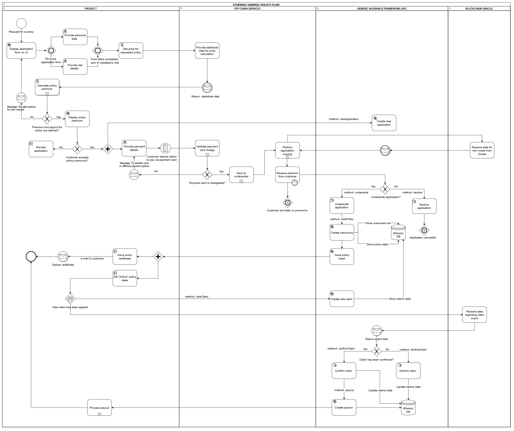

.. _rst_table_of_contents:

Implementing a product policy workflow
======================================
Using a generic policy workflow
-------------------------------
The GIF provides a list of entities to manage insurance business processes:

- an application 

- a policy

- a claim

- a payout

These entities represent a generic policy workflow. In the course of a workflow, the state of entities will be changed visualizing insurance business process.

A product contract is able to use a workflow with both prepaid (before issuing a policy) and postpaid (after issuing a policy) premiums. On the diagram below, there are more details for a default scheme with prepaid premiums.

There are two possible ways of choosing premiums by a customer of a product: based on a fixed premium (a payout will correspond with a chosen premium) and based on a fixed payout (a premium will correspond with the desired amount of a payout).

**A policy state flow diagram**

.. image:: policy_state_flow.jpg
    :scale: 100 %
    :align: center
    :alt: policy state flow

**The Business Process Model and Notation policy flow with prepaid premium diagram**

.. note:: An example of a policy flow described above is one of the two possible flows (with a premium paid before a policy is issued). It is also possible to pay a premium after a policy issuance.

Managing an application
_______________________
This insurance business process actually starts when any customer (or it might be an application from any organization that represents the interests of a group of customers) sends an application for an insurance policy via a user interface on a product contract level.

The DIP Protocol enables a product contract to perform the following actions:

- create an application

- underwrite an application

- decline an application

- revoke an application

Creating an application
.......................
To create an application for a policy, the **newApplication** function needs to be used. This function is invoked to store new application data, which contains such fields as a premium amount, currency, payout options, risk definition, etc. A policy buyer signs a policy agreement using this function.

The application state is "Applied." During scoring or underwriting processes, an application remains in the "Applied" status. 

The code below demonstrates how the function is called.

.. code-block:: solidity
   :linenos:

    function newApplication(
       bytes32 _customerExternalId,
       uint256 _premium,
       bytes32 _currency,
       uint256[] memory _payoutOptions
   ) internal returns (uint256 _applicationId) {
       _applicationId = productService.newApplication(
           _customerExternalId,
           _premium,
           _currency,
           _payoutOptions
       );
   }

Underwriting an application
...........................
To sign a policy agreement by a product contract, the **underwrite** function has to be used. 

As soon as an application is accepted by an underwriter, its state is changed to "Underwritten."  The application remains in the "Underwritten" state when a new policy is created.

The code below demonstrates how the function is invoked.

.. code-block:: solidity
   :linenos:

    function underwrite(uint256 _applicationId)
        internal
        returns (uint256 _policyId)
    {
        _policyId = productService.underwrite(_applicationId);
    }

Declining an application
........................
This function is used simply to decline an application. The application state changes to "Declined."

The code below illustrates how the function performs.

.. code-block:: solidity
   :linenos:

    function decline(uint256 _applicationId) internal {
        productService.decline(_applicationId);
    }

Managing a policy
_________________
By default, before issuing a policy, an underwriter must confirm that policy premiums are fully paid.

When a customer has an application underwritten and paid a premium for a product policy, the GIF methods allow to fulfill the following actions:

- create a policy

- expire a policy

Creating a policy
.................
This function allows to create a new entity: issue a new policy token. A policy is created with the "Active" state.

A product contract sends a PDF policy certificate to a customer using the PDF Generator core microservice.

Expiring a policy
.................
The function is used to set a policy expiration. The possible cases are the following:

- A policy duration date has expired.

- A risk for a policy has been confirmed and paid out (in case a risk is to be paid out once).

- The event has not been confirmed by an oracle in the course of a policy duration, which means no payout.

When the function is performed, a policy state is set as "Expired."

The code below demonstrates how to use the **expire** function.

.. code-block:: solidity
   :linenos:

    function expire(uint256 _policyId) internal {
        productService.expire(_policyId);
    }

Managing a claim
________________
The DIP allows products contracts to use the claim management methods. Specifically, the following actions can be performed:

- apply a claim 

- confirm a claim

- decline a claim

Applying a claim
................
The function is used to declare a new claim. The claim state is set as "Applied."

.. note:: Claims can be applied when a policy has the "Active" or "Expired" status.

The code below demonstrates how the function is invoked.

.. code-block:: solidity
   :linenos:

    function newClaim(uint256 _policyId) internal returns (uint256 _claimId) {
       _claimId = productService.newClaim(_policyId);
   }

Confirming a claim
..................
The function is used to confirm a claim. A new payout object is created after performing this action. The claim state is set as "Confirmed."

The code below illustrates how the function performs.

.. code-block:: solidity
   :linenos:

    function confirmClaim(uint256 _claimId, uint256 _amount)
       internal
       returns (uint256 _payoutId)
   {
       _payoutId = productService.confirmClaim(_claimId, _amount);
   }

Declining a claim
.................
This function is used to decline a claim. The claim state is set as "Declined."

The code below illustrates how the function is invoked.

.. code-block:: solidity
   :linenos:

    function decline(uint256 _applicationId) internal {
        productService.decline(_applicationId);
    }

Managing a payout
_________________
Confirming a payout
...................
The method is used to confirm the payout that has actually happened. The payout state changes to "PaidOut."

.. code-block:: solidity
   :linenos:

    function payout(uint256 _payoutId, uint256 _amount)
        internal
        returns (uint256 _remainder)
    {
        _remainder = productService.payout(_payoutId, _amount);
    }

Creating a new or update default policy workflow
------------------------------------------------
Currently, the GIF offers a general purpose default policy workflow to products contracts. In case a product contract needs to update a default workflow or create a new one, there are three possible options to do this:

1. Pull a request from a product contract. This request will be reviewed by the Etherisc team and merged with the existing workflow. It may also be a new version of a policy workflow.

2. Create an issue on GitHub. A product contract can create an issue, and, after reviewal, the Etherisc team will plan the requested improvements on a policy workflow.
3. Direct a request via e-mail: contact@etherisc.com.
