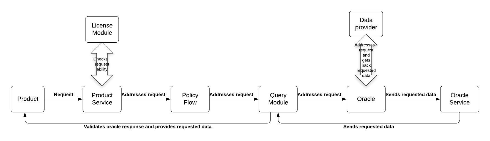

.. _rst_table_of_contents:

Managing oracles
================
Actors
------
- A **Product** is a contract that provides a specific service to customers.
- The **Query module** is a service that forwards requests to different oracle providers.
- An **Oracle** is a service used to provide specific data to products.

Description
-----------
Oracle services provide huge leverage to the Generic Insurance Framework.

Product contracts use an oracle to obtain off-chain data and confirm or decline real-world events vital for an insurance process. The scheme below illustrates the request flow from the beginning (a product sends a request) till the end (a product receives the requested data).

The GIF accomplished a strategy for product contracts to get data from a specific oracle, which a product is particularly interested in.

A workflow
----------
Registering an oracle
_____________________
- Any product owner, oracle owner, or the instance operator is able to register its oracle type, where they specify criteria for the oracles that provide data back to the requesting parties. For this purpose, the **proposeOracleType** function is used. The parameters, such as *oracleTypeName*, *inputFormat*, *inputDefinitions*, *callbackFormat*, *callbackDefinitions*, and currency are defined here. Then, the instance operator activates an oracle type. It can also deactivate an oracle type.
- **deactivateOracle** is used by the instance operator to deactivate an oracle.

Registering an oracle to type
_____________________________
- An oracle owner, a product owner, or the instance operator can propose a particular oracle. For this purpose, the **proposeOracleToType** method is called to propose a particular oracle to a particular oracle type.  The necessary parameters of the method are: *oracleTypeName*, *inputFormat*, *callbackFormat*, and a description.
- **revokeOracleToTypeProposal** is called by oracle owners or product owners to remove a proposal, before it is approved.
- **assignOracleToOracleType** is called by the instance operator to assign an oracle to an oracle type.
- **removeOracleFromOracleType** is called by the instance operator to remove an oracle from an oracle type.

Updating an oracle contract
___________________________
- Oracle owners or product owners can update an oracle contract for a particular oracle. 

- **updateOracleContract** is called to update an oracle contract.

Creating a request
__________________
- Product calls **request** a function.
- **ProductService** receives a request and verifies the correctness of the request according to the permissions of the License Module.
- **ProductSservice** addresses a request to a policy flow.
- A policy flow addresses a request to the query module to connect an oracle.
- The query module executes a request to a particular oracle that requests data from the data provider.
- An oracle calls to the requested data provider (i.e., Oraclize) to obtain the necessary data.
- **request** is called by a product contract to request data from an oracle by an oracle type. The request function uses the following arguments: *callbackMethodName*, *callbackContractAddress*, *oracleTypeName*, and *responsibleOracleID*.

Receiving a callback
____________________
- A particular data provider performs a callback to an oracle.
- An oracle sends a response to an oracle service with received data as an answer for the request.
- An oracle service addresses the received data to the query module, where the sender and the addressee are being verified. The query module specifies the response (which product contract made a query, what  an oracle type is, and which Oracle is to respond to the query).
- Then, the response is to be checked. An oracle is confirmed to be registered to the system and to be assigned to an oracle type, which corresponds to that of the query. If everything matches, then an oracle provides a product contract with the requested data.

Making Respond
______________
- An oracle contract makes a response using the **respond** method and sends the requested data in the **respond**.
- **respond** is called by an oracle service after an oracle responses to the request of a product contract. 
- The methods of the query module are used to communicate with oracles when an insurance application requires data or a decision of a particular actor.

The code below illustrates the functions that can be called by the **OracleQueryController**.

.. code-block:: solidity
   :linenos:

    interface IQueryController {
 
    function proposeOracleType(
        bytes32 _oracleTypeName,
        string calldata _inputFormat,
        string calldata _callbackFormat,
        string calldata _description
    ) external;
  
    function activateOracleType(bytes32 _oracleTypeName) external;
  
    function deactivateOracleType(bytes32 _oracleTypeName) external;
 
    function removeOracleType(bytes32 _oracleTypeName) external;
 
    function proposeOracle(
        address _sender,
        address _oracleContract,
        string calldata _description
    ) external returns (uint256 _oracleId);
 
    function updateOracleContract(
        address _sender,
        address _newOracleContract,
        uint256 _oracleId
    ) external;
 
    function activateOracle(uint256 _oracleId) external;
 
    function deactivateOracle(uint256 _oracleId) external;
 
    function removeOracle(uint256 _oracleId) external;
 
    function proposeOracleToType(
        address _sender,
        bytes32 _oracleTypeName,
        uint256 _oracleId
    ) external returns (uint256 _proposalId);
 
    function revokeOracleToTypeProposal(
        address _sender,
        bytes32 _oracleTypeName,
        uint256 _proposalId
    ) external;
 
    function assignOracleToOracleType(
        bytes32 _oracleTypeName,
        uint256 _proposalId
    ) external;
 
    function removeOracleFromOracleType(
        bytes32 _oracleTypeName,
        uint256 _oracleId
    ) external;
 
    function request(
        bytes calldata _input,
        string calldata _callbackMethodName,
        address _callabackContractAddress,
        bytes32 _oracleTypeName,
        uint256 _responsibleOracleId
    ) external returns (uint256 _requestId);
 
    function respond(
        uint256 _requestId,
        address _responder,
        bytes calldata _data
    ) external returns (uint256 _responseId);
    }
