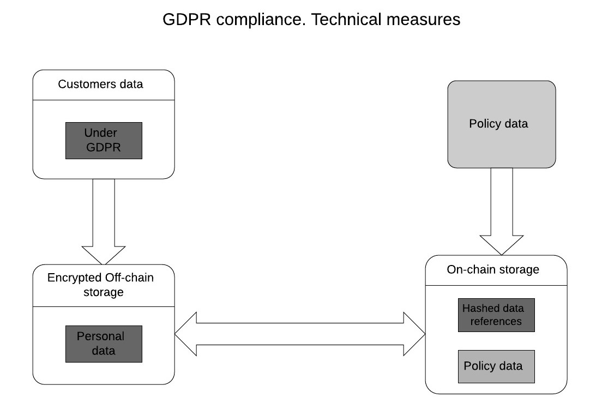

.. _rst_table_of_contents:

On-chain and off-chain storage
==============================
Any Product on the DIP has a choice of:

- what type of data to store
- where to store data

The DIP storage model allows products contracts to store its data on: 

- blockchain smart contracts
- a platform database
- a product database

.. note:: Payment card data should be stored on a payment provider level as it requires PCI compliance to store payment card data of customers in a database.

In many countries, a legal agreement is needed between a party that runs a storage service and a party that uses a storage service.

On-chain
--------
As the DIP operates in the Ethereum environment, the term **on-chain** specifies smart contracts, where a product can store risk description and specific metadata per policy.

The key principle of how the DIP itself uses data is that no personal data is kept in smart contracts — only **unique hashed references**.

The DIP allows to store data for any product regarding its:

- customers (**Note:** *first_name, last_name,* and *e-mail* fields are required by the GIF.)

- policies

- claims

In case a product doesn't want to use a platform database, it is possible to use the product's database.

.. attention:: 

    According to the EU General Data Protection Regulation requirements, we prevent you from storing personal data of customers on-chain. This data is to be stored **off-chain only**. There exist special identificators stored on-chain (hashed data references), which allow for retrieving data from an off-chain database. This prevents unauthorized access to sensitive data by an on-chain identificator. The diagram below illustrates the relations between on-chain and off-chain storage. This methodology implements the `"Positionspapier des Bundesblock," <https://bundesblock.de/wp-content/uploads/2017/10/bundesblock_positionspapier_v1.1.pdf>`_ the german association of blockchain companies which tries to implement this methodology in EU law.

Profiling
---------
To avoid the possibility of the so-called customer "profiling," each newly issued policy gets a new unique customer ID (unique hashed reference).

Make Payouts
============
In order to make payouts in fiat money, a product contract needs to use the GIF **Payout microservice**.

Your product **App** (here we mean a server App body of your product that connects and coordinates its on-chain and off-chain parts) needs to subscribe to the **Event Listener** microservice to get notifications about the off-chain events related to your product. This way, the product **App** knows that a new entity **“Payout”** appears with the **“expected”** state. To make a payout, a product contract should send a message to the framework with the following structure:

::

    {
      id: 'payout',
      type: 'object',
      properties: {
        policyId: { type: 'string' },
        payoutAmount: { type: 'number' },
        currency: { type: 'string' },
        provider: { type: 'string' },
        contractPayoutId: { type: 'string' },
      },

Where the *'policyId'*, *'payoutAmount'*, *'currency'*, *'provider'*, and *'contractPayoutId'* attributes are required to be defined.

The product contract sends the above-mentioned message to the **Payout** microservice. The information should contain the address where payout funds are to be transferred and the transfer method (e.g., transfer to a bank account, payment card, a transferwise, PayPal account, coin wallet, post transfer, etc.).

Below, you can find an example of a payout message (referred to a particular policy, with ID equal to 1) made by the Payout microservice (“Transferwise”). The payout is made in fiat money (100 EUR) and a product contract is to be notified about this.

.. code-block:: solidity
   :linenos:

    {
    policyId: 1,
    payoutAmount: 100,
    currency: 'EUR',
    provider: 'transferwise',
    }

To describe the process in more detail, we provide the following clarification of the interaction between the GIF and product components during the payout process.

There are a few entities involved in the process of payout: the *product smart contract*, the *product App*, the *ProductService contract*, the *Policy module* and some microservices (such as *Event Listener*, *Payout* microservice and *Ethereum signer*).

The process starts with confirming a claim by calling the **_confirmClaim** function in the product contract. This function is addressed to the **ProductService** contract, which delegates it to the **Policy module**. The function is performed here and an entity **“Claim”** changes its state to **“Confirmed”**.

At the same time, a new entity **“Payout”** is created at the **Policy** module with the **“expected”** state. When the states are changed, the **LogPayoutStateChanged** event takes place. This event, like many other events, is “listened” by a particular microservice — **Event Listener** subscribed to the events of the core contract. 

Then, Event Listener notifies the product **App** (with a business logic implemented) about this event. This **App** exchanges messages with other microservices involved (the **Payout** microservice and the **Ethereum signer** microservice) in order to make a payout. The **Ethereum signer** microservice can make payouts on the Ethereum blockchain. It also notifies the **product** contract, which calls the **_confirmPayout** function and addresses it to the **ProductService** contract. 

This results to a similar flow (*ProductService* — *Policy module* —  the payout changes state to *“Paid out”* — the *LogPayoutStateChanged* event occurs — *Event Listener* notifies the product *App* — the product *App* orders the *Notification* microservice to notify the customer about the payout — the *Notification* microservice sends a message to the customer and reports about it to the product *App*).
