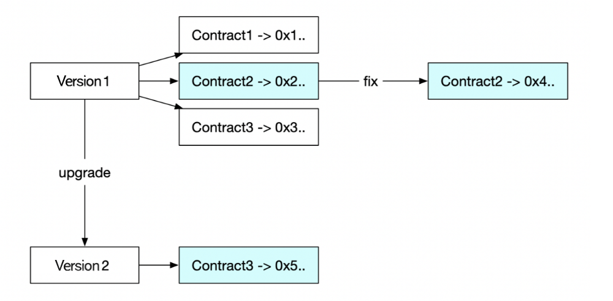

.. _rst_table_of_contents:

Upgrading policies
==================
Once an insurance agreement is signed and a policy is issued, parties cannot unilaterally change the specified behavior. It means, the framework must ensure that all the parties involved can always exactly predict which set of smart contracts will execute the policy.

There are two ways to provide upgradability of contracts within the system and two different situations that could trigger an update of a smart contract:

- **Fixes**. In case a bug has been detected. A bug is a deviation of expected behaviour to actual behaviour — a difference between a specification and an implementation. Bugs can be technical (a flawed implementation of a certain calculation leading to wrong results), but they can also occur in the translation process from legal prose to code. In this case, the specification would be flawed, and correct implementation of a flawed specification still leads to wrong results.
- **Upgrades**. New features need to be implemented for various reasons: modifications in pricing, a risk model, etc. In this case, the specification changes.

Both cases can occur on the core contract or product-specific contract levels.

We handle the two cases differently:

1. A “bug fix” upgrade will affect all policies, both the existing and new ones.

2. A “new feature” upgrade will affect only new policies. The existing policies will be executed with the original set of smart contracts (modulo bug fixes).

The following diagram illustrates the above-mentioned ways to change contracts and the result of such changes (when you get a new contract address). Then you can replace the existing contract by the new one if there was a “bug fixing,” or deploy a new “additional” version of the contract if there was an upgrade of the existing contract.

